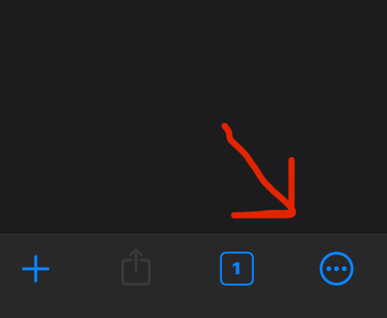
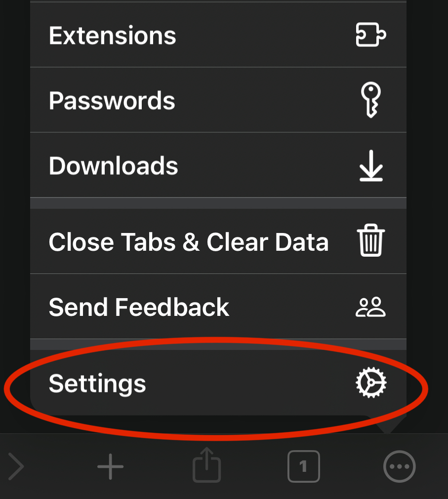

# Bettermint on iOS Setup Guide

## How to use Bettermint with the Orion Browser

Follow these steps to set up Bettermint on your iOS device using the Orion browser.

### Step 1: Install the Orion Web Browser
Download the Orion browser from the Apple App Store: [Orion Browser by Kagi](https://apps.apple.com/us/app/orion-browser-by-kagi/id1484498200)

### Step 2: Set Up the Orion Browser
Open the Orion browser and complete the initial setup.

### Step 3: Access Browser Settings
1. Click on the **three dots** located in the bottom corner of the browser.  
   
   
2. Select **Settings** from the menu.  
   

3. Tap on **Search** in the settings menu.  
   

4. In the **Search Engine** section, select **Google** as the default search engine.  
   

### Step 4: Install Mint V2 Extension
1. Go to the Chrome Web Store and search for **Mint V2** or use this direct link: [Mint V2 Chrome Extension](https://chromewebstore.google.com/detail/mint-v2/hjpjlhjhmbnpokpgdhpncefmchlonmhj)
   
2. Click **Add to Orion** to install the extension.  
   

🎉 **Congratulations!** You've installed Bettermint. Next, let's set it up.

## How to Set Up Bettermint

### Step 1: Get an Engine from Bettermint Sockets
1. Go to [Bettermint Sockets by Proton Dev](https://github.com/ProtonDev-sys/bettermint-sockets).
   
2. Scroll through the available engines and copy the configuration of the one you want to use. If your phone is slower or older, I recommend using engines that consume less RAM, like **Maia**.  
   

### Step 2: Configure Mint V2
1. Open Orion and click the **three dots** in the bottom corner again.  
   
   
2. Select **Mint V2** from the top of the drop-down menu.  
   

3. In the **Engine Server** section, paste the URL you copied from Bettermint Sockets into the text field next to the **URL API** label. Make sure to turn **Using API** on.  
   

### Step 3: Customize Settings
Modify the settings according to your preference.

### Step 4: Test and Play!
You’re ready to go! Start by playing against a bot to make sure everything works as expected.

---

Tutorial by @zig wangles
